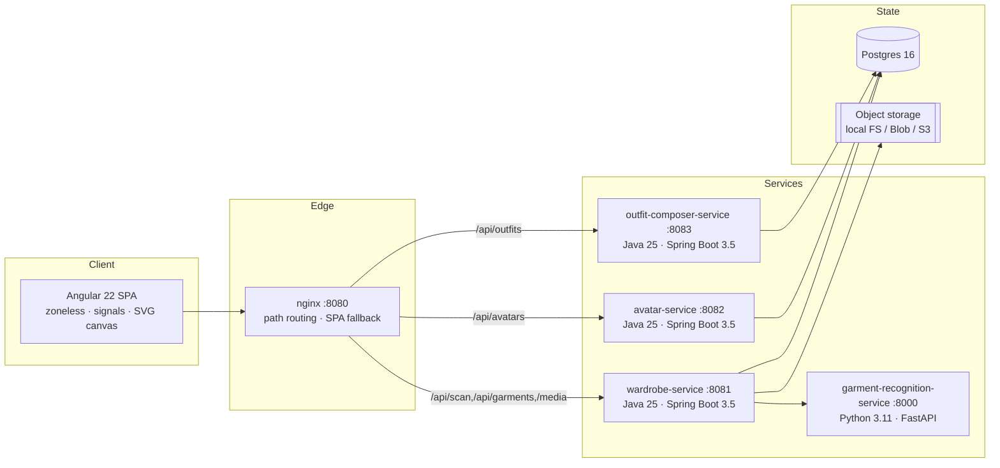
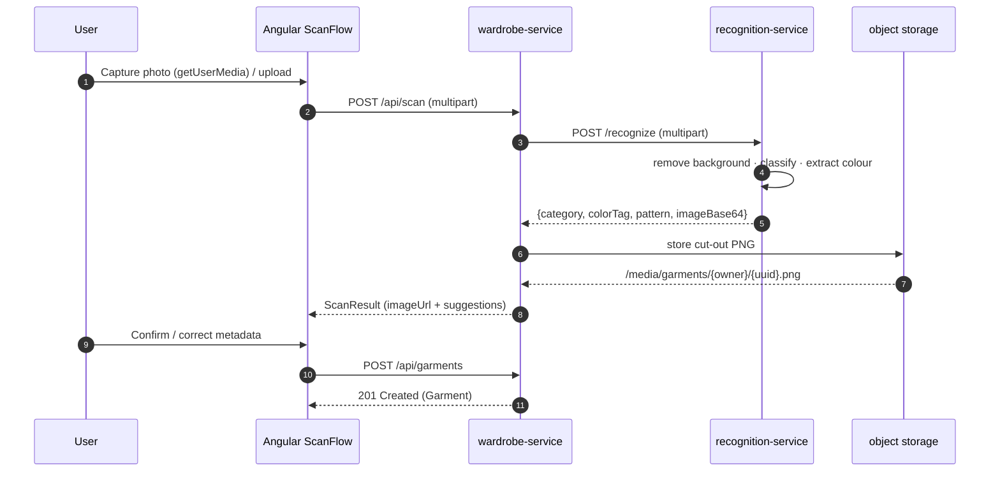
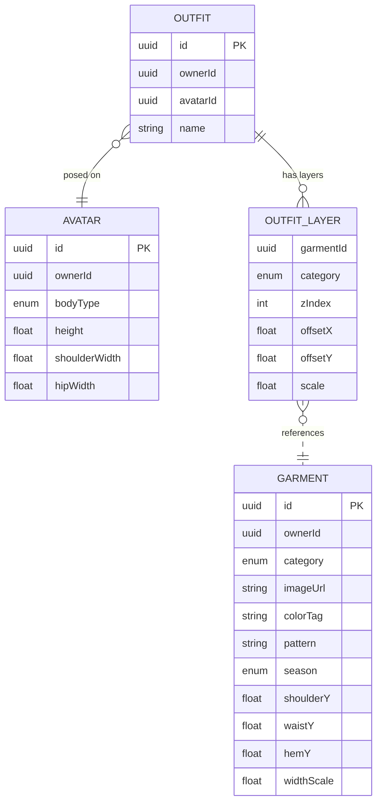
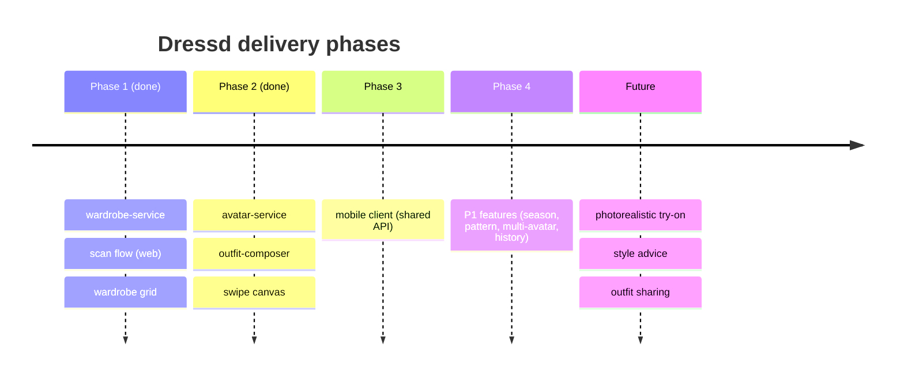

<!-- ╔══════════════════════════════════════════════════════════════════════╗ -->
<!-- ║  DRESSD — canonical repository README (over-engineered edition™)       ║ -->
<!-- ║  If you are looking for the 30-second version, jump to §3 Quickstart.  ║ -->
<!-- ╚══════════════════════════════════════════════════════════════════════╝ -->

<div align="center">

# 👕 Dressd

### _Your wardrobe, digitised. Scan. Cut out. Swipe. Wear (digitally)._

**A polyglot, event-shaped, microservice-oriented, client-composited digital-wardrobe platform**
that turns a phone photo of a garment into a background-removed, auto-categorised,
colour-tagged item you can swipe onto a 2D avatar to build outfits — in real time,
without a single GPU render on the server.

<!-- Badges are illustrative and reflect the pinned toolchain in this repo. -->


-DD0031)

-3776AB)


</div>

---

> [!NOTE]
> **This README is deliberately over-engineered.** It is longer than parts of the
> codebase and contains diagrams, an architecture-decision log, a glossary and a
> troubleshooting matrix. Every command and fact in it is real and current. The
> single source of truth for _scope_ remains [`docs/SPEC.md`](docs/SPEC.md).

---

## 📖 Table of Contents

1. [Executive summary](#1-executive-summary)
2. [Product vision & non-goals](#2-product-vision--non-goals)
3. [Quickstart (TL;DR)](#3-quickstart-tldr)
4. [System architecture](#4-system-architecture)
   - [4.1 C4 — System context](#41-c4--system-context)
   - [4.2 C4 — Containers](#42-c4--containers)
   - [4.3 Scan flow (sequence)](#43-scan-flow-sequence)
   - [4.4 Data model (ER)](#44-data-model-er)
5. [Technology matrix](#5-technology-matrix)
6. [Repository layout](#6-repository-layout)
7. [Local development](#7-local-development)
8. [Running the whole stack (Docker)](#8-running-the-whole-stack-docker)
9. [Configuration reference](#9-configuration-reference)
10. [API reference](#10-api-reference)
11. [Testing strategy](#11-testing-strategy)
12. [Architecture Decision Records (ADRs)](#12-architecture-decision-records-adrs)
13. [Security & privacy posture](#13-security--privacy-posture)
14. [Performance & scalability notes](#14-performance--scalability-notes)
15. [Roadmap](#15-roadmap)
16. [Troubleshooting](#16-troubleshooting)
17. [Glossary](#17-glossary)
18. [Contributing & conventions](#18-contributing--conventions)
19. [FAQ](#19-faq)
20. [License & acknowledgements](#20-license--acknowledgements)

---

## 1. Executive summary

Dressd solves a mundane but universal problem: **people forget what they own and
keep combining the same items**, because physically trying on clothes is tedious.

Dressd's answer is a three-verb loop:

```
  SCAN ────▶ background removed, category + colour suggested, you confirm
   │
   ▼
  SWIPE ───▶ flip through your items per category on a 2D silhouette
   │
   ▼
  WEAR ────▶ save the composed outfit; reopen it any time
```

The whole outfit compositing happens **client-side** on an HTML/SVG canvas, so the
backend never renders an image — it only stores positions. This is a deliberate
architectural bet that keeps the server cheap and the interaction instant, while
leaving an explicit upgrade path to photorealistic try-on later (the domain model
already separates garment _images_ from _rendering logic_).

**Status:** all P0 must-haves from [`docs/SPEC.md §6`](docs/SPEC.md) are implemented,
tested, and verified end-to-end.

---

## 2. Product vision & non-goals

### Vision
Web (Angular) **and** mobile clients over one shared REST backend. v1 ships web +
backend + recognition; mobile is deliberately deferred (see
[`docs/MOBILE.md`](docs/MOBILE.md)).

### Non-goals (v1) — _things we consciously refuse to build yet_
| # | Non-goal | Why |
|---|----------|-----|
| NG-1 | 3D / photorealistic try-on | Simple 2D overlay is cheaper and instant |
| NG-2 | Social features (share/follow) | Out of the core loop |
| NG-3 | AI style recommendations | Not the v1 problem |
| NG-4 | Size / fit simulation | Garments always "fit" the silhouette |
| NG-5 | Wear/wash-season tracking | Backlog, not core |

> Non-goals are a feature. They are what keeps the "over-engineered README" from
> describing an over-engineered _product_.

---

## 3. Quickstart (TL;DR)

**Everything, in containers:**

```bash
docker compose up --build
# Web UI ............ http://localhost:8080
# wardrobe-service .. http://localhost:8081
# avatar-service .... http://localhost:8082
# outfit-service .... http://localhost:8083
# recognition ....... http://localhost:8000
# Postgres .......... localhost:5432  (dressd / dressd)
```

**Just poke the API** (no UI, uses the offline recognition fallback if the sidecar is down):

```bash
curl -F "file=@some-shirt.jpg" http://localhost:8081/api/scan
```

That's the TL;DR. The other 17 sections are the "over-engineered" part. 🧑‍🔬

---

## 4. System architecture

Dressd is a **modular monorepo** containing four independently deployable services
plus one web client. Communication is REST/JSON. There is no shared database between
services — each owns its own schema (or, in dev, its own H2 file).

### 4.1 C4 — System context


### 4.2 C4 — Containers



> Ports, routing rules and the zero-CORS story are all real — see `web/nginx.conf`
> and `web/proxy.conf.json`.

### 4.3 Scan flow (sequence)

The canonical happy path (SPEC.md flow A). Note that **nothing is persisted until
the user confirms** — the scan endpoint is side-effecting only on object storage.



If the recognition sidecar is unreachable, `wardrobe-service` transparently falls
back to a **deterministic local stub** so the flow never hard-fails.

### 4.4 Data model (ER)



> Cross-service references (an `OUTFIT_LAYER.garmentId` pointing at a `GARMENT`)
> are intentionally **soft** — there is no FK across service boundaries. The client
> resolves them from its cached wardrobe collection.

---

## 5. Technology matrix

| Layer | Choice | Version | Rationale |
|---|---|---|---|
| Backend language | Java | **25** | Latest available JDK (26 not yet GA); records, sealed types, pattern matching |
| Backend framework | Spring Boot | **3.5.16** | First-class Java 25 support; MVC + Data JPA + Validation + Actuator |
| Build (backend) | Maven | 3.9 | Multi-module reactor |
| Web framework | Angular | **22** | Zoneless, standalone components, signals |
| Web state | NgRx Signal Store | 21.1.1¹ | Signal-native store for the wardrobe cache |
| Web tests | Vitest | 4 | New `@angular/build:unit-test` runner (Karma retired) |
| Web language | TypeScript | 6 | Ships with Angular 22 |
| Recognition | Python + FastAPI | 3.11 | Light segmentation + classification sidecar |
| Image processing | Pillow (+ optional rembg) | — | Offline colour-key fallback; rembg for quality |
| Database | PostgreSQL / H2 | 16 / file | Postgres in prod, H2 file in dev (zero infra) |
| Object storage | Local FS / Blob / S3 | — | `ObjectStorage` interface, pluggable |
| Edge | nginx | 1.27 | SPA hosting + reverse proxy |

¹ _NgRx has no v22 release yet (it trails Angular by a major). 21.1.1 works on
Angular 22's stable signal APIs; install with `--legacy-peer-deps`._

---

## 6. Repository layout

```
Dressd/
├── docs/
│   ├── SPEC.md                     # ← canonical scope/architecture (leidend)
│   └── MOBILE.md                   # why mobile is deferred (Phase 3)
├── backend/                        # Java 25 / Spring Boot 3.5 reactor
│   ├── pom.xml                     # parent (versions, Java release)
│   ├── service.Dockerfile          # shared multi-stage build (ARG SERVICE)
│   ├── common/                     # shared enums + ApiError + OwnerContext
│   ├── wardrobe-service/           # :8081  garments, scan, filters, storage
│   ├── avatar-service/             # :8082  avatars + body-type presets
│   └── outfit-composer-service/    # :8083  outfits (garment layers)
├── recognition-service/            # Python / FastAPI :8000
│   ├── app/{main,recognition,models}.py
│   ├── requirements*.txt
│   └── tests/
├── web/                            # Angular 22 SPA
│   ├── src/app/
│   │   ├── core/                   # models, API clients, WardrobeStore
│   │   └── features/{scan,wardrobe,builder,outfits}/
│   ├── proxy.conf.json             # dev same-origin routing
│   ├── nginx.conf                  # prod same-origin routing
│   └── Dockerfile
├── docker-compose.yml              # the whole stack
└── README.md                       # you are here (allegedly)
```

---

## 7. Local development

### 7.1 Prerequisites matrix

| Tool | Minimum | Notes |
|---|---|---|
| JDK | 25 | `java -version` → 25.x |
| Maven | 3.9 | or use the reactor directly |
| Node.js | **≥ 22.22.3** or 24.x | Angular 22 CLI enforces this |
| npm | 10+ | ships with Node |
| Python | 3.11 | for the recognition sidecar |
| Docker | 24+ | only for the full-stack compose path |

### 7.2 Run each piece (no Docker, no external infra)

Backend services default to a **local H2 file DB**, so they start with nothing else running.

```bash
# 1) Recognition sidecar
cd recognition-service
python3 -m venv .venv && . .venv/bin/activate
pip install -r requirements-dev.txt
uvicorn app.main:app --port 8000

# 2) Backend services (three shells, or run only what you need)
cd backend
mvn -pl wardrobe-service          spring-boot:run   # :8081
mvn -pl avatar-service            spring-boot:run   # :8082
mvn -pl outfit-composer-service   spring-boot:run   # :8083

# 3) Web (dev server proxies /api and /media to the services)
cd web
npm install --legacy-peer-deps    # NgRx has no v22 yet
npm start                         # http://localhost:4200
```

---

## 8. Running the whole stack (Docker)

```bash
docker compose up --build
```

- Java services run with the **`prod`** profile → Postgres.
- The `web` container's nginx routes `/api/*` and `/media/*` to the right service,
  so the browser only ever talks to one origin → **no CORS**.
- Persistent volumes: `pgdata` (database) and `media` (stored PNGs).

Tear down (and wipe data):

```bash
docker compose down -v
```

---

## 9. Configuration reference

All backend services read config from `application.yml` with a `prod` profile
override. Environment variables (prod profile):

| Variable | Service(s) | Default | Meaning |
|---|---|---|---|
| `SPRING_PROFILES_ACTIVE` | all | `default` (H2) | set `prod` for Postgres |
| `DB_URL` | all | `jdbc:postgresql://localhost:5432/dressd` | JDBC URL |
| `DB_USER` / `DB_PASSWORD` | all | `dressd` / `dressd` | DB creds |
| `RECOGNITION_URL` | wardrobe | `http://recognition-service:8000` | sidecar base URL |
| `STORAGE_ROOT` | wardrobe | `/data/media` | object-storage root |
| `STORAGE_PUBLIC_URL` | wardrobe | `/media` | public URL prefix |
| `CORS_ORIGINS` | all | `http://localhost:4200` | allowed browser origins |
| `dressd.recognition.enabled` | wardrobe | `true` | `false` = always use local stub |

Recognition sidecar:

| Variable / flag | Default | Meaning |
|---|---|---|
| `rembg` installed? | no | if present, high-quality cut-out; else offline colour-key |

---

## 10. API reference

> Auth (v1): every request may carry an **`X-Owner-Id: <uuid>`** header. When absent,
> a fixed demo owner is used, so the app is usable before a real IdP is wired in.
> All responses are JSON; errors use a uniform `ApiError` body.

### wardrobe-service — `:8081`

| Method | Path | Purpose |
|---|---|---|
| `POST` | `/api/scan` | Multipart photo → cut-out + suggested metadata (no persistence) |
| `GET` | `/api/garments?category=&color=&season=` | List/filter the wardrobe |
| `GET` | `/api/garments/{id}` | Fetch one garment |
| `POST` | `/api/garments` | Persist a confirmed garment |
| `PATCH` | `/api/garments/{id}` | Partial metadata update (re-categorise, recolour) |
| `DELETE` | `/api/garments/{id}` | Remove a garment |
| `GET` | `/media/**` | Fetch a stored cut-out PNG |

### avatar-service — `:8082`

| Method | Path | Purpose |
|---|---|---|
| `GET` | `/api/avatars/body-types` | Static preset catalog (slim/average/curvy/custom) |
| `GET` | `/api/avatars` | List the owner's avatars |
| `GET` | `/api/avatars/{id}` | Fetch one avatar |
| `POST` | `/api/avatars` | Create an avatar (defaults applied from body type) |
| `PUT` | `/api/avatars/{id}` | Update an avatar |
| `DELETE` | `/api/avatars/{id}` | Remove an avatar |

### outfit-composer-service — `:8083`

| Method | Path | Purpose |
|---|---|---|
| `GET` | `/api/outfits` | List saved outfits (newest first) |
| `GET` | `/api/outfits/{id}` | Fetch one outfit (layers ordered by z-index) |
| `POST` | `/api/outfits` | Save an outfit (avatar + garment layers) |
| `PUT` | `/api/outfits/{id}` | Update an outfit |
| `DELETE` | `/api/outfits/{id}` | Remove an outfit |

### recognition-service — `:8000`

| Method | Path | Purpose |
|---|---|---|
| `GET` | `/health` | Reports which background-removal backend is active |
| `POST` | `/recognize` | Multipart photo → `{category, colorTag, pattern, imageBase64}` |

---

## 11. Testing strategy

The classic pyramid, honoured across three runtimes:

```
                 ▲  fewer, slower
        ┌────────┴────────┐
        │  e2e (manual /   │  live cross-service scan flow, curl-driven
        │  scripted curl)  │
        ├──────────────────┤
        │  integration     │  @SpringBootTest (real Tomcat + H2),
        │  (Java + Python) │  FastAPI TestClient, MockRestServiceServer
        ├──────────────────┤
        │  component/unit  │  Angular Vitest (jsdom), pure functions
        └──────────────────┘
                 ▼  more, faster
```

| Suite | Command | Count |
|---|---|---|
| Backend (all services) | `cd backend && mvn test` | 7 |
| Recognition | `cd recognition-service && . .venv/bin/activate && pytest` | 6 |
| Web | `cd web && npx ng test --watch=false` | 2 |

> A dedicated `RecognitionClientTest` exercises the **real** RestClient multipart
> path (via `MockRestServiceServer`) — the path that a stub-based integration test
> skips, and the one that once surfaced a missing `reactive-streams` dependency in
> live e2e. Lesson encoded as a regression test.

---

## 12. Architecture Decision Records (ADRs)

Condensed ADRs for the decisions the spec left open (SPEC.md §8).

<details>
<summary><strong>ADR-001 — Client-side compositing, no server render</strong></summary>

**Status:** Accepted · **Context:** Outfit preview must feel instant and the server
should stay cheap. **Decision:** the backend stores only garment images and layer
_positions_ (z-index/offset/scale); the Angular SVG canvas composites layers in the
browser. **Consequences:** zero GPU on the server; swipes need no network once the
wardrobe is cached; photorealistic try-on remains a future, additive upgrade.
</details>

<details>
<summary><strong>ADR-002 — Header-based owner identity (no IdP yet)</strong></summary>

**Status:** Accepted (v1) · **Decision:** the caller is identified by an
`X-Owner-Id` header with a demo default. **Consequences:** trivial to develop
against; a real IdP (Auth0 / Azure AD B2C) can populate the header at a gateway
without touching downstream services.
</details>

<details>
<summary><strong>ADR-003 — Pluggable object storage, local FS in dev</strong></summary>

**Status:** Accepted · **Decision:** cut-out PNGs go through an `ObjectStorage`
interface; the shipped `LocalObjectStorage` serves them under `/media/**`.
**Consequences:** runs with zero cloud credentials; swap for Azure Blob / S3 in prod.
</details>

<details>
<summary><strong>ADR-004 — Recognition as a Python sidecar with graceful fallback</strong></summary>

**Status:** Accepted · **Decision:** background removal + classification live in a
FastAPI service; wardrobe-service calls it over REST and falls back to a
deterministic stub when it is unavailable. **Consequences:** the scan flow never
hard-fails; the ML surface can evolve independently of the JVM services.
</details>

<details>
<summary><strong>ADR-005 — Java 25 instead of the requested Java 26</strong></summary>

**Status:** Accepted · **Context:** Java 26 is not yet GA / not installable in the
build environment. **Decision:** target Java 25 (newest available) with Spring Boot
3.5.16. **Consequences:** a one-line bump (`java.version`, base images) when 26 ships.
</details>

<details>
<summary><strong>ADR-006 — Angular 22 zoneless + Vitest</strong></summary>

**Status:** Accepted · **Decision:** adopt Angular 22's zoneless change detection
and the Vitest-based unit-test runner. **Consequences:** signal-driven components
get change detection "for free"; Karma is retired; `@ngrx/signals` pinned to 21.1.1
(no v22 yet) via legacy peer deps.
</details>

---

## 13. Security & privacy posture

| Concern | v1 stance |
|---|---|
| AuthN/Z | `X-Owner-Id` header; every query is owner-scoped in the repository layer |
| Multi-tenancy | Row-level: services filter by `ownerId`; no cross-owner reads |
| Uploads | Size-capped (15 MB) at both the servlet and FastAPI layers |
| CORS | Explicit allow-list; prod uses same-origin nginx so CORS is moot |
| Secrets | Externalised via env vars; none committed (see `.gitignore`) |
| PII | Only images the user scans; stored blobs are owner-partitioned by path |

> ⚠️ v1 auth is intentionally minimal and **not** production-grade. ADR-002 is the
> upgrade path. Do not ship this to real users without a real IdP.

---

## 14. Performance & scalability notes

- **Swipe latency:** the entire wardrobe is cached client-side in `WardrobeStore`,
  so swiping between garments triggers **no network call**.
- **Recognition:** images are downscaled to ≤512px before processing to bound CPU
  and memory regardless of upload size.
- **Statelessness:** the Java services hold no session state → horizontally scalable
  behind a load balancer; state lives in Postgres + object storage.
- **Cold start:** H2-file dev mode boots in ~4s; there is no external dependency to
  wait on locally.

---

## 15. Roadmap



- **P1 backlog:** season tag & filter (partially in place), pattern detection
  (best-effort implemented), multiple avatars, "last worn" history.
- **P2 backlog:** diffusion-based try-on, recommendations, social sharing.

---

## 16. Troubleshooting

| Symptom | Likely cause | Fix |
|---|---|---|
| `ng` fails: "requires Node ≥ 22.22.3" | Old Node | Use Node 24 (`nvm use 24`) |
| `npm install` peer-dep error on `@ngrx/signals` | No NgRx v22 yet | `npm install --legacy-peer-deps` |
| Scan returns 500, recognition never called | sidecar down + a real bug | check `wardrobe-service` logs; stub should engage — if not, verify `reactive-streams` on classpath |
| `/actuator/health` → 404 | actuator starter missing | it's included now; rebuild |
| Web loads but API calls 404 in dev | proxy not active | ensure `ng serve` uses `proxy.conf.json` |
| Cut-out has no transparency | rembg absent + noisy background | offline colour-key needs a fairly uniform backdrop; install `rembg` for quality |
| Postgres refuses connection in compose | DB not healthy yet | services wait on healthcheck; retry, or `docker compose logs postgres` |

---

## 17. Glossary

| Term | Definition |
|---|---|
| **Garment** | One scanned wardrobe item (cut-out PNG + metadata + anchor points) |
| **Anchor points** | Normalised (0..1) vertical attach points + width scale used to place a garment on the silhouette |
| **Avatar** | A 2D silhouette defined by a body type + proportions (no ML) |
| **Body type** | One of `SLIM`, `AVERAGE`, `CURVY`, `CUSTOM`; each has a preset |
| **Outfit** | A named set of garment _layers_ posed on an avatar (positions only) |
| **Layer** | `{garmentId, category, zIndex, offsetX, offsetY, scale}` |
| **Colour-key** | Offline background removal by keying out the corner-sampled colour |
| **Owner** | The tenant a resource belongs to, carried in `X-Owner-Id` |
| **Signal Store** | NgRx signal-based state container for the wardrobe cache |
| **Zoneless** | Angular change detection without zone.js, driven by signals |

---

## 18. Contributing & conventions

- **Branching:** git-flow — `main` (stable) · `develop` (integration) · `feature/*`
  · `release/*` · `hotfix/*`.
- **Commits:** [Conventional Commits](https://www.conventionalcommits.org/)
  (`feat:`, `fix:`, `chore:`, `docs:`, `refactor:`, `test:` …).
- **Code style:** match the surrounding code; Angular uses Prettier
  (`web/.prettierrc`); Java follows standard Spring conventions.
- **Definition of done:** compiles, tests green in the touched runtime(s), and any
  behavioural change verified by exercising the real flow — not just unit tests.

---

## 19. FAQ

**Q: Why is this README so long?**
A: You asked for an over-engineered one. This is the artisanal, small-batch,
free-range version. The 30-second path is [§3](#3-quickstart-tldr).

**Q: Where's the actual spec?**
A: [`docs/SPEC.md`](docs/SPEC.md). It is _leidend_ (leading). This README defers to it.

**Q: Why Java 25 and not 26?**
A: 26 isn't GA / installable here. See [ADR-005](#12-architecture-decision-records-adrs).

**Q: Is `@ngrx/signals` really on a different major than Angular?**
A: Yes — NgRx trails Angular by a major; 21.1.1 works fine on Angular 22's stable
signal APIs. Hence `--legacy-peer-deps`.

**Q: Why no server-side rendering of outfits?**
A: [ADR-001](#12-architecture-decision-records-adrs). Instant + cheap now,
photorealistic later.

**Q: Where's mobile?**
A: Deferred on purpose — the platform choice is an open question. See
[`docs/MOBILE.md`](docs/MOBILE.md).

---

## 20. License & acknowledgements

**License:** none declared yet. Until a `LICENSE` file exists, treat this as
"all rights reserved" by the repository owner.

**Built with:** Spring Boot · Angular · NgRx · FastAPI · Pillow · rembg · PostgreSQL ·
H2 · nginx · and an unreasonable number of Markdown tables.

<div align="center">

_Scan. Swipe. Wear. — the rest is just positions on a canvas._ 👕✨

</div>
