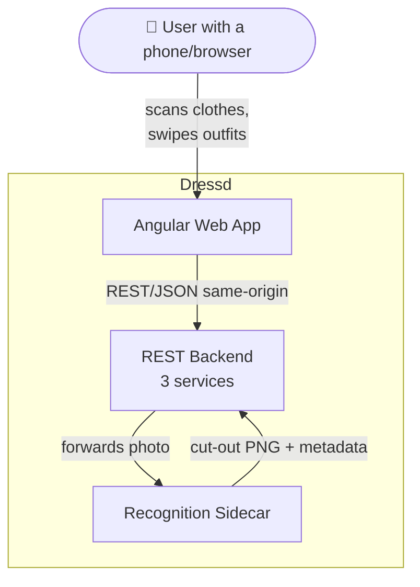
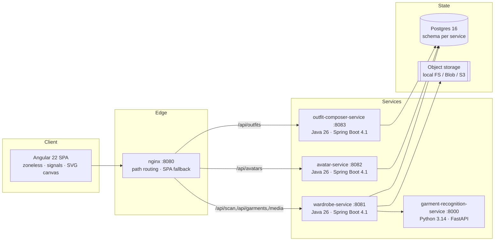
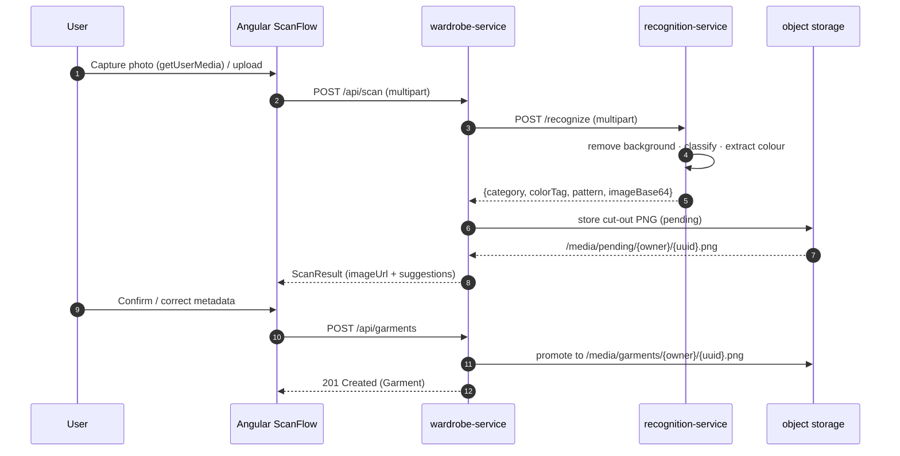
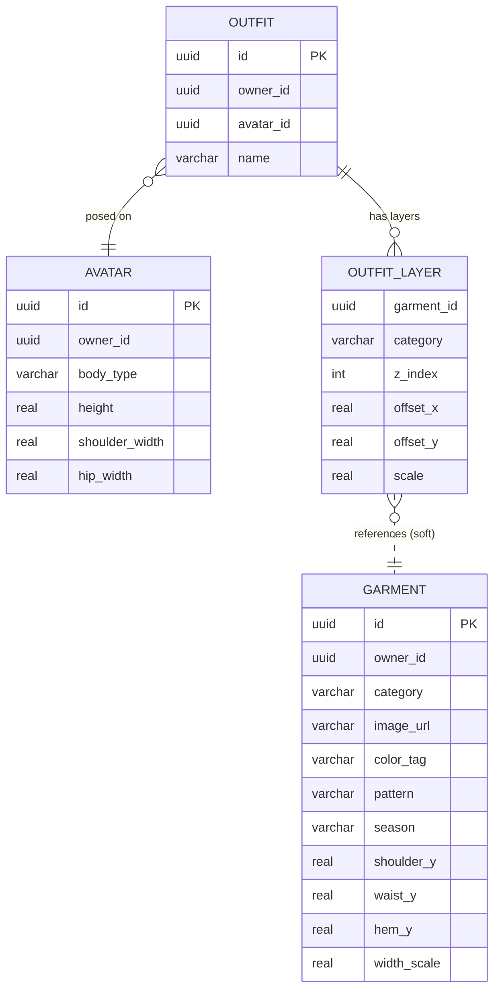
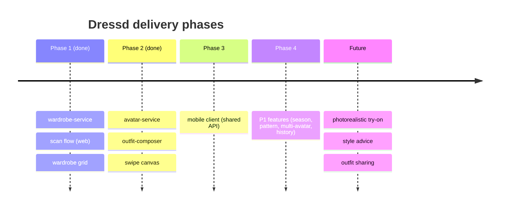

<div align="center">

# 👕 Dressd

### _Your wardrobe, digitised. Scan. Cut out. Swipe. Wear (digitally)._

**A polyglot, microservice-oriented, client-composited digital-wardrobe platform**
that turns a phone photo of a garment into a background-removed, auto-categorised,
colour-tagged item you can swipe onto a 2D avatar to build outfits — in real time,
without a single GPU render on the server.


-DD0031)

-3776AB)


</div>

---

Dressd solves a mundane but universal problem: **people forget what they own and
keep combining the same items**, because physically trying on clothes is tedious.

Its answer is a three-verb loop:

```
  SCAN ────▶ background removed, category + colour suggested, you confirm
   │
   ▼
  SWIPE ───▶ flip through your items per category on a 2D silhouette
   │
   ▼
  WEAR ────▶ save the composed outfit; reopen it any time
```

Outfit compositing happens **client-side** on an HTML/SVG canvas, so the backend
never renders an image — it only stores positions. That is a deliberate
architectural bet: it keeps the server cheap and the interaction instant, while
leaving an explicit upgrade path to photorealistic try-on later, because the domain
model already separates garment _images_ from _rendering logic_
([ADR-001](docs/ADR.md#adr-001--client-side-compositing-no-server-render)).

**Scope lives in [`docs/SPEC.md`](docs/SPEC.md)** and it is leading. All P0
must-haves are implemented and tested.

## Quickstart

```bash
cp .env.example .env
docker compose up --build

# Web UI ............ http://localhost:8080
# wardrobe-service .. http://localhost:8081
# avatar-service .... http://localhost:8082
# outfit-service .... http://localhost:8083
# recognition ....... http://localhost:8000
# Postgres .......... localhost:5432
```

Poke the API without the UI:

```bash
curl -F "file=@some-shirt.jpg;type=image/jpeg" http://localhost:8081/api/scan
```

> The compose stack runs with `AUTH_MODE=DEV`, which is **unauthenticated by
> design** — it is a local dev orchestration. Deployments get `TOKEN` mode by
> default and refuse to start without a secret. See
> [`docs/SECURITY.md`](docs/SECURITY.md).

## Documentation

| Document                                             | What's in it                                                  |
| ---------------------------------------------------- | ------------------------------------------------------------- |
| [`docs/SPEC.md`](docs/SPEC.md)                       | Canonical scope and architecture — **leading**                 |
| [`docs/API.md`](docs/API.md)                         | Endpoints, auth, pagination, error contract                    |
| [`docs/ADR.md`](docs/ADR.md)                         | Architecture decisions and the reasoning behind them           |
| [`docs/CONFIGURATION.md`](docs/CONFIGURATION.md)     | Every environment variable and property                       |
| [`docs/SECURITY.md`](docs/SECURITY.md)               | Auth modes, upload controls, and the known gaps                |
| [`docs/TROUBLESHOOTING.md`](docs/TROUBLESHOOTING.md) | Symptom → cause → fix                                         |
| [`docs/GLOSSARY.md`](docs/GLOSSARY.md)               | Domain vocabulary                                             |
| [`docs/MOBILE.md`](docs/MOBILE.md)                   | Why mobile is deferred to Phase 3                             |
| [`CONTRIBUTING.md`](CONTRIBUTING.md)                 | Branching, tests, migrations, definition of done               |

## Product vision & non-goals

Web (Angular) **and** mobile clients over one shared REST backend. v1 ships web +
backend + recognition; mobile is deliberately deferred
([`docs/MOBILE.md`](docs/MOBILE.md)).

### Non-goals (v1) — _things we consciously refuse to build yet_

| #    | Non-goal                       | Why                                          |
| ---- | ------------------------------ | -------------------------------------------- |
| NG-1 | 3D / photorealistic try-on     | Simple 2D overlay is cheaper and instant     |
| NG-2 | Social features (share/follow) | Out of the core loop                         |
| NG-3 | AI style recommendations       | Not the v1 problem                           |
| NG-4 | Size / fit simulation          | Garments always "fit" the silhouette         |
| NG-5 | Wear/wash-season tracking      | Backlog, not core                            |

> Non-goals are a feature. They are what keeps the product from sprawling.

## System architecture

Four independently deployable services plus one web client, communicating over
REST/JSON. Each service owns its own database schema
([ADR-007](docs/ADR.md#adr-007--flyway-migrations-and-a-schema-per-service)).

### System context



### Containers



Ports and routing rules are real — see `web/nginx.conf` and `web/proxy.conf.json`.
Because nginx serves the app and the API from one origin in the compose stack, the
browser never makes a cross-origin request.

### Scan flow

The canonical happy path (SPEC.md flow A). **Nothing is persisted until the user
confirms**, so the cut-out lands in a pending area and is promoted on confirm
([ADR-009](docs/ADR.md#adr-009--confirm-on-write-media-lifecycle)).



If the recognition sidecar is unreachable, `wardrobe-service` falls back to a
deterministic local stub, so the flow never hard-fails. The user confirms every scan
anyway, which is what makes a wrong guess acceptable.

### Data model



`OUTFIT_LAYER.garment_id` crosses a service boundary and carries **no** foreign key.
The client resolves layers from its cached wardrobe and reports any that no longer
resolve ([ADR-008](docs/ADR.md#adr-008--no-cross-service-referential-integrity)).

## Technology matrix

| Layer              | Choice                    | Version      | Rationale                                                    |
| ------------------ | ------------------------- | ------------ | ------------------------------------------------------------ |
| Backend language   | Java                      | **26**       | Current feature release; records, sealed types, pattern matching |
| Backend framework  | Spring Boot               | **4.1.0**    | Modular MVC + Data JPA + Validation + Actuator starters      |
| Migrations         | Flyway                    | —            | Schema is a reviewable artefact, not a Hibernate side effect  |
| Build (backend)    | Maven                     | 3.9.11       | Multi-module reactor                                         |
| Web framework      | Angular                   | **22**       | Zoneless, standalone components, signals                     |
| Web state          | NgRx Signal Store         | 21.1.1¹      | Signal-native store for the wardrobe cache                   |
| Web tests          | Vitest                    | 4            | New `@angular/build:unit-test` runner (Karma retired)        |
| Web language       | TypeScript                | 6            | Ships with Angular 22                                        |
| Recognition        | Python + FastAPI          | 3.14         | Light segmentation + classification sidecar                  |
| Image processing   | Pillow (+ optional rembg) | —            | Offline colour-key fallback; rembg for quality               |
| Database           | PostgreSQL / H2           | 16 / file    | Postgres in prod, H2 file in dev (zero infra)                |
| Object storage     | Local FS / Blob / S3      | —            | `ObjectStorage` interface, pluggable                         |
| Observability      | Micrometer + Prometheus   | —            | Metrics, plus trace ids across the service hops              |
| Edge               | nginx                     | 1.29         | SPA hosting + reverse proxy                                  |

¹ _NgRx trails Angular by a major. 21.1.1 works on Angular 22's stable signal APIs;
install with `--legacy-peer-deps`._

## Repository layout

```
Dressd/
├── docs/                           # SPEC, ADRs, API, config, security, …
├── backend/                        # Java 26 / Spring Boot 4.1 reactor
│   ├── service.Dockerfile          # shared multi-stage build (ARG SERVICE)
│   ├── common/                     # auth, error contract, pagination, CORS
│   │                               #   (a Boot auto-configuration, not copy-paste)
│   ├── wardrobe-service/           # :8081  garments, scan, filters, storage
│   ├── avatar-service/             # :8082  avatars + body-type presets
│   └── outfit-composer-service/    # :8083  outfits (garment layers)
│       └── src/main/resources/db/migration/   # Flyway, per service
├── recognition-service/            # Python / FastAPI :8000
├── web/                            # Angular 22 SPA
│   ├── src/app/core/               # models, API clients, WardrobeStore
│   └── src/app/features/{scan,wardrobe,builder,outfits}/
├── .github/workflows/ci.yml        # backend · web · recognition · images
├── docker-compose.yml              # the whole stack
└── .env.example                    # copy to .env
```

## Local development

Backend services default to a **local H2 file DB**, so they start with nothing else
running.

```bash
# 1) Recognition sidecar
cd recognition-service
python3 -m venv .venv && . .venv/bin/activate
pip install -r requirements-dev.txt
uvicorn app.main:app --port 8000

# 2) Backend services (three shells, or run only what you need)
cd backend
mvn -pl wardrobe-service        spring-boot:run   # :8081
mvn -pl avatar-service          spring-boot:run   # :8082
mvn -pl outfit-composer-service spring-boot:run   # :8083

# 3) Web (dev server proxies /api and /media to the services)
cd web
npm ci --legacy-peer-deps
npm start                                         # http://localhost:4200
```

Prerequisites and the full test commands are in
[`CONTRIBUTING.md`](CONTRIBUTING.md).

## Testing

| Suite                  | Command                                    | Count |
| ---------------------- | ------------------------------------------ | ----- |
| Backend (all services) | `cd backend && mvn verify`                 | 50    |
| Web                    | `cd web && npm test`                       | 28    |
| Recognition            | `cd recognition-service && pytest`         | 10    |

CI runs all three on every push and pull request, plus a container image build.

Two tests worth singling out, because they encode lessons rather than coverage:

- **`RecognitionClientTest`** exercises the *real* RestClient multipart path via
  `MockRestServiceServer` — the path a stub-based integration test skips, and the one
  that once surfaced a missing `reactive-streams` dependency in live e2e.
- **`TokenAuthIntegrationTest`** asserts that `TOKEN` mode rejects a request carrying
  `X-Owner-Id`. That header is the obvious bypass, so it gets a test that fails loudly
  if anyone ever "helpfully" makes the resolver fall back to it.

## Performance & scalability notes

- **Swipe latency:** the wardrobe is cached client-side in `WardrobeStore`, so
  swiping between garments triggers no network call. The cache walks pages to fill
  itself, capped at 20 pages, and tells the user if it stopped early.
- **Recognition:** images are downscaled to ≤512px before processing, and rejected
  above 40 megapixels, bounding CPU and memory regardless of upload size.
- **Statelessness:** the Java services hold no session state, so they scale
  horizontally behind a load balancer; state lives in Postgres + object storage.
- **Pagination:** every collection endpoint is bounded server-side (max 200 per
  page), so no client can ask a service to materialise an unbounded result set.
- **Storage growth:** bounded by confirmed garments plus at most one TTL window of
  abandoned scans; deleting a garment deletes its image.

## Roadmap



- **P1 backlog:** season tag & filter (in place), pattern detection (best-effort),
  multiple avatars, "last worn" history.
- **P2 backlog:** diffusion-based try-on, recommendations, social sharing.
- **Known technical follow-ups:** a real identity provider in place of the interim
  signed token ([ADR-002](docs/ADR.md#adr-002--signed-token-owner-identity-header-mode-for-local-work)),
  and an event-driven prune for dangling outfit layers
  ([ADR-008](docs/ADR.md#adr-008--no-cross-service-referential-integrity)).

## License

[MIT](LICENSE).

**Built with:** Spring Boot · Angular · NgRx · FastAPI · Pillow · rembg ·
PostgreSQL · H2 · Flyway · Micrometer · nginx.

<div align="center">

_Scan. Swipe. Wear. — the rest is just positions on a canvas._ 👕✨

</div>
